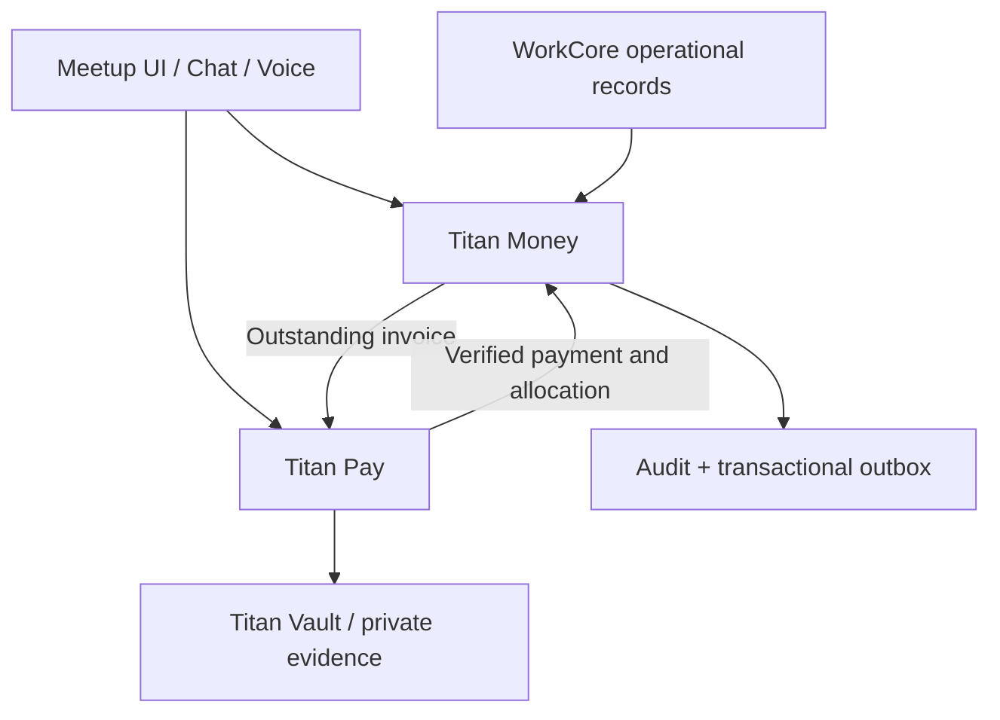

# Titan Money and Titan Pay architecture

## Canonical domains

- **Titan Money** owns customers used for billing, products used for invoice lines, tax profiles, invoices, recurring invoices, receivables, payments, allocations, credit notes, audit records and transactional outbox events.
- **Titan Pay** owns collection sessions, payment methods, gateway connections, signed gateway events, payment claims, protected evidence, gateway transactions, bank deposits and reconciliation.
- **Meetup / Titan Channels** remains the communication and interface host.
- **WorkCore** remains the operational authority for companies, properties, jobs, work orders and service obligations when the complete WorkCore domain is merged.

## Non-negotiable payment flow

1. Titan Money creates or issues an invoice.
2. Titan Pay creates a high-entropy collection session and stores only a hash of its public token.
3. The customer selects a permitted method.
4. Card providers redirect to hosted checkout.
5. The browser return page only reads current state.
6. A provider sends a signed webhook to the exact gateway-connection URL.
7. Titan Pay validates signature, completed state, amount, currency and idempotency.
8. Titan Pay creates a verified Titan Money payment and allocation in one transaction.

## Runtime identifiers

- Namespace: `App\Domains\TitanMoney`
- Web prefix: `/titan-money`
- API prefix: `/api/titan-money/v1`
- Route prefix: `titanmoney.`
- Permission prefix: `titanmoney.`
- Table prefix: `titan_money_`
- Config key: `titanmoney`
- Command prefix: `titan-money:`

## Names removed

The former generic `Finance` bounded-context name, `ZeroPayModule`, and runtime `InvoixPro` namespaces are not part of the merged application. Historical donor names appear only in migration tooling and audit documentation.
